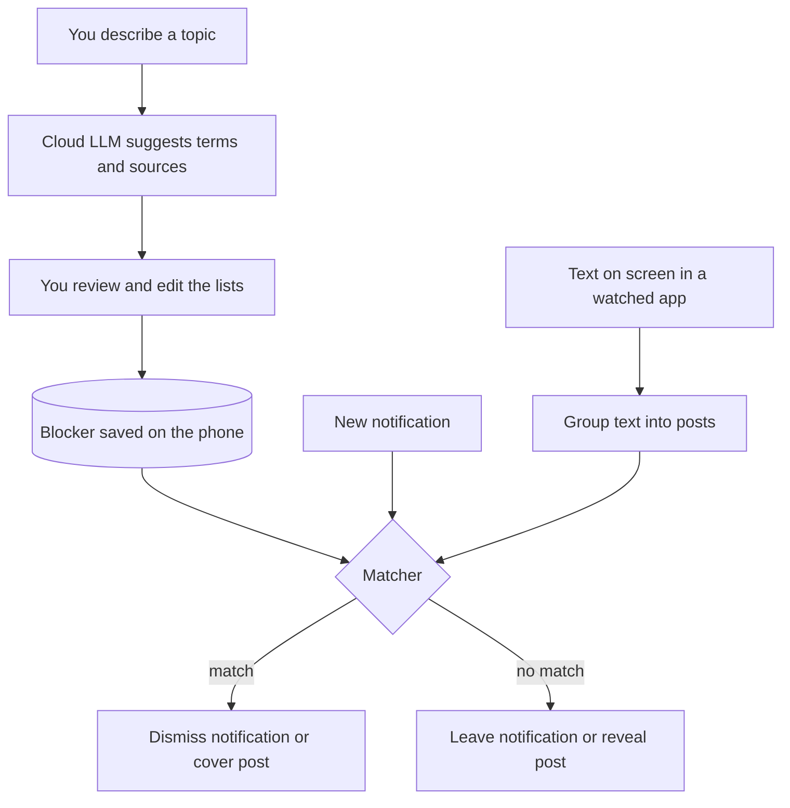

# Architecture: Spoiler Blocker v1

Last updated: 2026-10-05. Status: early build. The
[build plan](BUILD_PLAN.md) shows what exists so far.

## What v1 is

An Android app for one phone: a Galaxy S25 Ultra on Android 16 (One UI 8.5).
You describe a topic and switch a blocker on. While it is on:

- Posts about the topic in YouTube and Instagram are covered with a black box.
- Notifications about the topic are dismissed and kept in a list inside the app.

A blocker stays on until you switch it off.

v1 hides **everything related to the topic**. It does not try to judge whether
a particular post actually gives away an outcome.

## How to read this document

Every decision has one of three statuses:

| Status | Meaning |
|---|---|
| Confirmed | Agreed by the owner in the design discussion. |
| Proposed | Recommended in the design discussion but not yet confirmed. |
| Needs experiment | Depends on a fact that must be measured on the phone. Phase 0 of the [build plan](BUILD_PLAN.md) covers these. |

Proposed items are the plan unless the owner says otherwise. The section
"Open decisions" lists the ones that most need an answer.

## How it works

### Creating a blocker

1. You type a description, for example "2026 Japanese Grand Prix", and choose a
   breadth: **narrow** (this race) or **broad** (all of F1).
2. The app sends that description, the breadth and today's date to a cloud
   LLM. Nothing from the screen is sent.
3. The LLM returns three lists:
   - **Strong terms** block a post by themselves: "Japanese Grand Prix",
     "Suzuka", "#JapaneseGP".
   - **Weak terms** are ambiguous and need support: "Max", "podium", "P1".
   - **Sources** are channel and account names: "FORMULA 1", "Sky Sports F1".
4. You review and edit the lists. They are saved on the phone.

### While a blocker is on

**Notifications.** Android tells the app about each new notification. The app
passes the sending app's name, the title and the text to the matcher. A match
is dismissed and added to a "hidden while blocking" list in the app, so you can
see afterwards that a friend messaged you. The list conceals each entry's text
until you tap it, because that text is the spoiler.

Three limits come from Android. A notification marked as ongoing, such as a
media player's, cannot be dismissed by another app, so it is left alone. A
conversation shown as a bubble cannot be hidden: dismissing it only removes its
entry from the notification shade, and the bubble stays on screen. Text that an
app draws in its own custom layout cannot be read, so it cannot be matched.

Notifications in a group are each judged on their own text. When a group's
summary matches, the whole group is dismissed, because the summary would
otherwise be shown by itself, and each notification that went with it is
listed.

That listing has one gap. Android holds every new notification back for about
200 ms before any app is told about it. A notification that is still being
held when its group's summary is dismissed goes with the group, and it cannot
be listed, because no app was ever told that it existed.

**Status.** While any blocker is on, a silent notification names the blockers
that are on, so that a forgotten one stays visible. If notifications are not
actually being hidden, because notification access is off, it says that
instead. Swiped away, it comes back. Nothing extra keeps it there: Android
itself keeps the notification listener running and starts it again after the
phone restarts. Without notification access it only comes back when the app is
opened.

**Screen.**

1. The app's accessibility service receives events only from the apps you chose
   to watch, and only while a blocker is on.
2. When scrolling starts, the scrolling area is covered.
3. When scrolling settles, the service reads the text the app exposes to screen
   readers and groups it into posts (title, channel or account, caption).
4. Each post goes to the matcher. Results are cached, so a post seen before is
   decided instantly.
5. Matched posts keep a black box sized to the post. Everything else is
   revealed.

Steps 2 and 5 are the "fail closed" behaviour: nothing new is visible until it
has been checked. How strict this needs to be depends on Phase 0 measurements.

### Matching rules

Terms and text are first cut into words in the same way. Everything is made
lower case and accents are removed. Anything that is not a letter or a digit
only separates words. Inside a hashtag or a name, a new word also starts at a
capital after a small letter and wherever letters meet digits, so
"#JapaneseGP2026" is the words japanese, gp, 2026.

A term is found in a text when the letters and digits of the term, run
together, are the letters and digits of one or more whole words of the text
that follow each other, run together.

So the spaces, punctuation and capitals inside a term do not matter:
"Japanese GP" is found in "Japanese G.P.", "#JapaneseGP" and "#japanesegp".
Where a term starts and ends does matter: "Max" is found in "Max's lap" but
not in "maximum".

A post or notification is blocked when any of these is true. They are checked
in this order, and the first that is true is the reason shown:

- Its channel or account contains one of the blocker's sources.
- It contains a strong term.
- It contains two or more different weak terms.
- It contains one weak term and the blocker's breadth is broad.

Terms are looked for in the text of a post, and sources in its channel or
account name. For a notification, the sources are looked for in the app's
name, the title and the names of the people who sent its messages. Two terms
with the same letters, such as "Man U" and "Manu", count as one term.

Known misses:

- Word endings: "podium" is not found in "podiums".
- Small letters run together: "Suzuka" is not found in "#suzukacircuit".
- A number stuck to a number: "F1" is not found in "#F12026".
- Letters such as "ø" and "ß" typed as "o" and "ss".

Known over-blocks, accepted because a miss costs more (decision 4):

- Neighbouring words that add up to a term: "therapist" in "the rapist".
- A short term inside a name: "You" in "YouTube".
- A short term that is also an ordinary word: "US" in "join us".

Chinese, Japanese and Thai have no spaces between words, so a term in those
scripts is found anywhere in the text.

There is no model in this path in v1. The rules are deliberately simple so
that it is always possible to see why something was or was not blocked.

### Components

| Component | Job |
|---|---|
| App screens | Create, edit and switch blockers. Show hidden notifications and service health. |
| Keyword expansion | One cloud LLM call when a blocker is created. |
| Matcher | Applies the matching rules. Plain Kotlin with no Android dependencies, so it can be tested on a PC. |
| Notification listener | Receives notifications, asks the matcher, dismisses matches. |
| Screen reader | The accessibility service. Reads on-screen text and groups it into posts. |
| Overlay manager | Draws and removes the black boxes. |
| Health monitor | Shows a status notification while a blocker is on and warns if the screen reader stops. |

## Decisions

| # | Decision | Status | Why |
|---|---|---|---|
| 1 | Personal use first, with publishing kept possible. | Confirmed | Every hard unknown is answered fastest on one phone. Publishing adds a Play review whose outcome can't be predicted. |
| 2 | The repository is public. No secrets, model weights or real phone captures are committed. | Confirmed (public), Proposed (rules) | Real captures contain other people's names and messages. |
| 3 | Minimum Android version is 14 (API 34). The target is Android 16. | Proposed | One device to support. Android 14 added per-window screenshots and better overlay attachment, which later phases rely on. |
| 4 | Topic blocking, not spoiler detection. | Confirmed | A miss ruins the event and over-blocking costs little. No phone-sized model judges spoilers reliably. |
| 5 | Each blocker has a breadth: narrow or broad. | Proposed | Lets a race blocker stay tight while a "nothing about this film" blocker goes wide. |
| 6 | An accessibility service reads the screen and a notification listener handles notifications. | Confirmed | These are the only Android mechanisms that can see other apps' content. |
| 7 | No model in the live matching path in v1. | Proposed | Keywords and sources are instant, private and explainable. Whether a model would catch more is unknown until v1's misses are measured. |
| 8 | A cloud LLM is used only when a blocker is created. | Proposed | Expansion needs current world knowledge a small on-device model lacks. Only the typed description, the breadth and today's date leave the phone. |
| 9 | Terms are split into strong, weak and sources. | Proposed | Sources catch posts whose text gives nothing away. The weak tier stops common words from over-blocking. |
| 10 | Only apps on a watch list are read. v1 watches YouTube, then Instagram. | Proposed | The service never sees banking or other apps, and it costs no battery elsewhere. |
| 11 | Fail closed: cover while scrolling, reveal after checking. | Confirmed as the intent. Exact behaviour needs experiment. | Overlay position updates arrive late, so a box cannot reliably follow a moving post. |
| 12 | A blocker stays on until switched off. | Confirmed | Owner's requirement. A status notification makes a forgotten blocker visible. |
| 13 | Dismissed notifications are listed in the app. | Proposed | Silently losing a friend's message is worse than seeing later that one was hidden. |
| 14 | The matcher is a separate plain-Kotlin module. | Proposed | It can be unit-tested on a PC without a phone or YouTube. |
| 15 | No screen text is stored or sent anywhere in normal use. | Proposed | The service can read private content. Debug capture is opt-in, stays on the phone and is never committed. |
| 16 | The notification blocker is built first. | Proposed | It is small, useful by itself and a gentle first Android project. |
| 17 | The app shows whether the screen reader is alive. | Proposed | If Android or One UI stops the service, nothing is covered. Without a signal that failure is silent. |

## Budgets

These are targets to check and revise after Phase 0, not measurements.

| Budget | Target |
|---|---|
| No blocker on | The service receives no events. |
| Blocker on, unwatched app in front | The service receives no events. |
| Reading and matching one screen | Under 30 ms. |
| Time from scroll settling to reveal | Under 150 ms. |
| Network use | One call per blocker created. It is normally one request, and up to three when the model pauses during a long search. None while blocking. |

## Not in v1

| Item | Why it waits | What would bring it in |
|---|---|---|
| On-device text model | Its benefit is unmeasured and the candidates are weeks old. | v1's measured misses show related posts slipping past the lists. |
| Thumbnail scanning | Needs screenshots, which are rate-limited, and is a second pipeline. The owner wants this eventually. | After v1: on-device text recognition first, vision models later. |
| Reels, Shorts and Stories beyond their caption text | The spoiler is in the video and audio, which the app cannot read. | Phase 0 shows what these screens expose. |
| Audio muting | The app cannot mute another app selectively. | A reliable way to pause playback is found. |
| Tap to reveal a covered post | A box that accepts taps also swallows scroll gestures. | A touch design that keeps scrolling smooth. |
| Other surfaces: Google Discover, Chrome, search suggestions, widgets | Each needs its own check of what it exposes. | YouTube and Instagram work well. |
| Automatic expiry of blockers | The owner wants blockers to stay on until switched off. | The owner asks for it. |
| Play Store release | Needs a declaration, in-app disclosure and a review. | A month of personal use goes well. |

## Rejected alternatives

| Alternative | Why it was rejected |
|---|---|
| Detecting actual spoilers instead of blocking the topic | Needs a model to reason about an event it knows nothing about. Misses are the costly error. |
| A keyword filter followed by a model as the only design | A model that sees only keyword hits can only un-block posts. It never catches a related post with no keyword. |
| Hosted Jev in the live screen path | Feed text, including private messages, would leave the phone. Each call adds 70 to 500 ms plus the network, which lengthens every blackout. It accepts text only. |
| Cloud vision model on every thumbnail | Thumbnails leave the phone. Roughly $0.25 to $1 per hour of scrolling and about 90 MB of upload, by rough estimate. |
| Gemini Nano, which is built into the phone | Google blocks it unless the calling app is in the foreground, so it cannot run while YouTube is in front. |
| Laya without fine-tuning | A write-up of its model card reports zero-shot accuracy below a majority-class baseline. |
| Supporting many Android versions and devices now | Multiplies testing for no benefit to a personal app. |

## Model options considered

Researched on 2026-10-04. Figures are the authors' own claims and were not
verified. None of the image-capable models has published phone benchmarks.

| Model | Size | Input | Licence | Notes |
|---|---|---|---|---|
| [Jev](https://openrouter.ai/blog/insights/what-is-jev/) (TypeSafe) | Undisclosed | Text | Closed, hosted only | $0.042 per million input tokens. |
| [EmbeddingGemma](https://huggingface.co/bmabir17/embeddinggemma-300m) | 308M, about 200 MB | Text | Gemma terms | Model card lists S25 Ultra benchmarks: 7.8 ms on the NPU at 256 tokens. Gives a similarity score, not yes or no. |
| [Decima-small](https://github.com/amyrmahdy/decima) | 122M, about 140 MB at 8-bit | Text, 20 languages | Apache-2.0, some training data non-commercial | About 20 ms per decision on one laptop CPU core. |
| [Laya](https://github.com/receptron/laya) | 421M English, 322M multilingual | Text | Apache-2.0 | About 613 MB at 8-bit. Weak without fine-tuning. |
| [OneJev-0.8B](https://huggingface.co/OmniJev/OneJev-0.8B) | About 1B, 0.68 GB at 4-bit | Text, image, video | Apache-2.0 | 31 ms on a datacentre GPU. No phone data. |
| [Valen](https://github.com/Liuziyu77/Valen) | 0.8B and 2B | Text, image, video | Apache-2.0 | Preview weights only. |
| [Laya Vision](https://github.com/r33drichards/laya-vision) | 201M | Text, image | Weights non-commercial | Experimental. About 3 s per image on a free cloud CPU. |

If v1's measured misses justify a text model, EmbeddingGemma and Decima-small
are the first two to test, on the same labelled examples.

## Open risks

1. **Many spoilers are not text.** A podium photo, text burned into a
   thumbnail, a Reel's video and audio, and a Story are all invisible to the
   screen reader. Source matching reduces this but does not remove it.
2. **Overlays may lag behind scrolling.** If the lag is large, strict covering
   is the only safe mode, and feeds go black on every scroll.
3. **YouTube and Instagram can change without notice.** Anything that depends
   on their internal structure will break after an update. Post grouping has to
   be generic and easy to adjust.
4. **The service can stop silently.** One UI's battery management may stop it.
   The health signal detects this but cannot prevent it.
5. **A notification may flash before it is dismissed.** The app is told after
   the notification is posted. The size of the gap is unmeasured.
6. **Everything depends on the term lists.** A missing driver or character name
   is a miss. The lists are made once, so late developments are not covered.
   The model is also told not to list a name whose presence would itself be
   a spoiler, such as a surprise guest. The owner reads the lists before
   watching, so such a name is left out, and posts that mention only that
   name are missed.
7. **This is a first Android project.** Two system services, overlays and
   background limits are among the harder parts of Android. Redeploying during
   development can also switch the accessibility service off.
8. **Platform rules may tighten.** Google Play reviews non-accessibility uses
   of the accessibility API. Android 17 test builds block such apps for users
   who turn on Advanced Protection Mode.
9. **Debug captures are sensitive.** They must stay on the phone or the PC and
   out of this public repository.

## Open decisions

These need the owner's answer. The plan assumes the proposal in each case.

| Question | Proposal |
|---|---|
| Is v1's live matching model-free? | Yes. Revisit after Phase 6. |
| How long is a typical blocker on: hours or weeks? | Unknown. It decides how much over-blocking and screen covering is tolerable. |
| Strict covering while scrolling, or cover only matched posts and accept a brief flash? | Strict by default, with a relaxed setting, decided after Phase 0. |
| What does a tap on a covered post do? | Nothing special in v1: touches pass through so scrolling still works. To see a post, pause the blocker. |
| Which cloud LLM does keyword expansion? | The Claude API with web search, so lists reflect current facts. One call per blocker, to `claude-opus-5-5`. The cost of a call has not been measured; a rough guess is some tens of US cents. |
| Which Instagram screens are in v1? | The home feed. Reels, Stories and messages are decided after Phase 0. |
| What licence does the repository use? | None chosen yet. |

## Sources

- [What Is Jev? (OpenRouter)](https://openrouter.ai/blog/insights/what-is-jev/)
- [Jev privacy and retention guide](https://jev101.org/guides/jev-privacy-guide)
- [awesome-jev: list of open Jev-like models](https://github.com/cobanov/awesome-jev)
- [Laya write-up (AI Weekly)](https://aiweekly.co/alerts/convai-ships-laya-a-421m-modernbert-decision-model-apache-20)
- [laya-onnx-int8](https://huggingface.co/inferenceprince/laya-onnx-int8)
- [OneJev-0.8B GGUF](https://huggingface.co/bartowski/OmniJev_OneJev-0.8B-GGUF)
- [Kev benchmarks](https://github.com/jaredpalmer/kev)
- [Bekko System One benchmarks](https://github.com/hotchpotch/bekko-system-one)
- [llama.cpp vision on Snapdragon 8 Elite](https://github.com/ggml-org/llama.cpp/issues/27649)
- [ML Kit GenAI Prompt API (Gemini Nano limits)](https://developers.google.com/ml-kit/genai/prompt/android)
- [Gemini API pricing](https://ai.google.dev/gemini-api/docs/pricing)
- [AccessibilityService source (screenshot interval)](https://android.googlesource.com/platform/frameworks/base/+/refs/heads/main/core/java/android/accessibilityservice/AccessibilityService.java)
- [Google Play: use of the AccessibilityService API](https://support.google.com/googleplay/android-developer/answer/10964491?hl=en)
- [Android 17 Advanced Protection and accessibility](https://finance.biggo.com/news/202602151902_android-advanced-protection-accessibility-api-restrictions)
